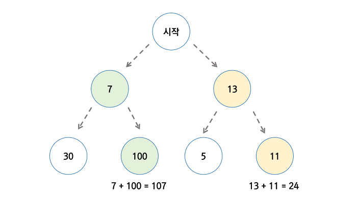

# 탐욕법

### 탐욕 알고리즘 


개요 : 탐욕 알고리즘은 최적 해를 구하는 상황에서 사용하는 방법이다. 여러 경우 중 하나를 선택할 때 **그 상황에서 가장 좋다고 생각하는  방을 선택해** 나가는 방식으로 진행하여 답을 구한. 즉, 미래를 생각하지 않고 각 단계에서 가장 최선의 선택을 하는 기법입니다. 현재의 선택이 최종적으로 가장 최선의 선택이 되기를 바라는 알고리즘이라 볼 수 있다.

그러나 다음과 같은 경우를 보면, 최적의 해를 보장하지 않는 경우도 존재한다.



### 알고리즘의 개요

1. 해 선택 : 현재 주어진 값 중 가장 최적인 해를 구한 뒤, 이를 부분 해 집합에 추가한다.
2. 적절성 검사 : 새로운 부분 해 집합이 적절한지 검사한다.
3. 해 검사 : 새로운 부분 해 집합이 문제의 해가 되는지 검사한다. 아직 문제의 해가 완성되지 않았다면 처음 단계로 돌아간다.


### 알고리즘의 활용


#### 최소 수의 동전으로 거스름돈 거슬러 주기

해 : 거슬러 줄 총액에 해당하는 동전의 수

최적의 해 : 동전의 개수가 최소일 때

####  **문제 : 10원, 50원, 100원, 500원, 1000원이 있을 때, 2,750원를 교환할 수 있는 최소 동전 개수를 구하라.** 

```text
def solution(money):
    result = 0
    coin = [10,50,100,500,1000]
    dictionary = {}
    dictionary = dict.fromkeys(coin)
    for c in reversed(coin):
        tmp = int(money/c)
        result = result + tmp
        dictionary[c] = tmp
        money = money - (tmp * c)
    return result


if __name__ == '__main__':
    input = 2750
    print(solution(input))
```

#### 체육복 문제 

_점심시간에 도둑이 들어, 일부 학생이 체육복을 도난당했습니다. 다행히 여벌 체육복이 있는 학생이 이들에게 체육복을 빌려주려 합니다. 학생들의 번호는 체격 순으로 매겨져 있어, 바로 앞번호의 학생이나 바로 뒷번호의 학생에게만 체육복을 빌려줄 수 있습니다. 예를 들어, 4번 학생은 3번 학생이나 5번 학생에게만 체육복을 빌려줄 수 있습니다. 체육복이 없으면 수업을 들을 수 없기 때문에 체육복을 적절히 빌려 최대한 많은 학생이 체육수업을 들어야 합니다._


이 문제에서 가장 최적의 해는 무엇일까.. 

잃어버리는 친구와 빌려주는 친구는 반드시 1명은 있다. 집합으로 풀어도 될것같은데.. 

set로 푼다고 가정을 해보면, lost 와 reserve의 여집합이 교집합을 가지고 있을 수도 아닐 수도 있다.


\_\_

\_\_

\_\_


출처 : [_https://programmers.co.kr/learn/courses/30/lessons/42862_](https://programmers.co.kr/learn/courses/30/lessons/42862)\_\_


